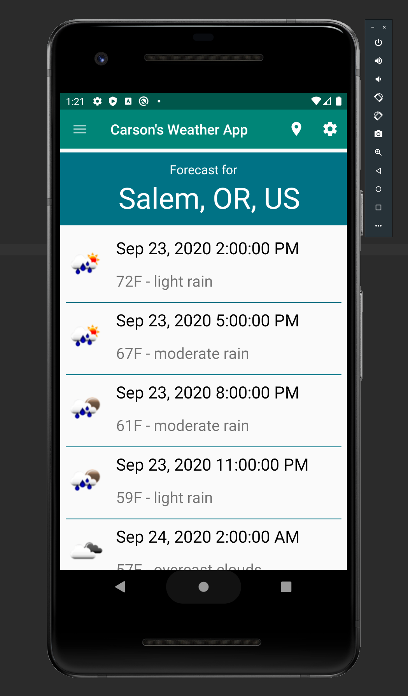

# WeatherApp2.0
A much better and improved android weather app. Based off of my previous project WeatherApp: https://github.com/PembleC/WeatherApp

### Built With
* [Android Studio](https://developer.android.com/studio)
* [SQLite](https://www.sqlite.org/index.html)
* [Google Maps](https://www.google.com/maps/)

## Screenshots
#### Main Activity  

#### Weather Details  

#### Saved Locations  

#### Sharing the Weather Details  

#### Settings Changing Location  

## Contributing
Contributions are what make the open source community such an amazing place to be learn, inspire, and create. Any contributions you make are **greatly appreciated**.
1. Fork the Project
2. Create your Feature Branch (`git checkout -b feature/AmazingFeature`)
3. Commit your Changes (`git commit -m 'Add some AmazingFeature'`)
4. Push to the Branch (`git push origin feature/AmazingFeature`)
5. Open a Pull Request

## Contact 
Carson Pemble - [LinkedIn](https://www.linkedin.com/in/carson-pemble/) - pemblec@oregonstate.edu - pemblec.github.io
Porfolio Link: [https://pemblec.github.io/](https://pemblec.github.io/)
